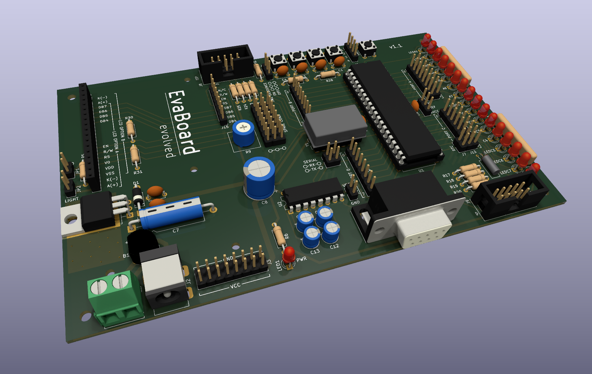

# EvaBoard evolved
## An Evaluation Board for the ATmega644(A)

This is an evaluation board for the ATmega644(A). It is inspired by (and compatible with) the [evaluation board](https://www.embedded.rwth-aachen.de/doku.php?id=lehre:atmegaevaboard)  used in the lab course "Praktikum Systemprogrammierung" in the computer science curriculum at RWTH Aachen. 

This repository contains:

- A richly illustrated [Guide Book](Guide/EvaBoardGuide.pdf) with everything you need to know to build and use the board
- A [KiCAD project](KiCAD/) with the [Schematic](KiCAD/Schematic.pdf) and a PCB layout, ready to be manufactured
- The [bill of materials](BOM/BOM.pdf)
- Drivers for the [LCD](Drivers/LCD/) and the [serial port](Drivers/Serial/)
- [Test code](Tests/) for testing and debugging the board

Related projects:

- [SRAM Board evolved](https://github.com/7vgn/SRAMBoard/), an add-on board with 128kBytes of additional SRAM
- [AD/DA Board evolved](https://github.com/7vgn/ADDABoard/), an add-on board for experimenting with analogue-digital and digital-analogue conversion

> [!NOTE]
> I have a small number of PCBs left over. If you're a student wanting to build the board, [contact me](https://github.com/7vgn/EvaBoard/discussions). 
